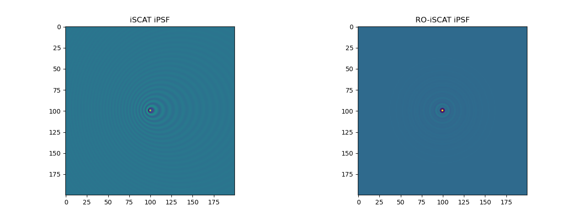

# RO-iSCAT

This is the companion modelling code to our paper:

[Using rotational integration of oblique interferometric scattering (RO-iSCAT) to track axial spatiotemporal responses of membrane protrusions](https://www.biorxiv.org/content/10.1101/2025.03.23.644841v1).


## System Requirements

### Tested Environment

    - Windows 10 PRO 22H2
    - Python 3.13
    - NVIDIA GeForce RTX 4090 24GB
    - CUDA 12.8

### Installation

- Create an anaconda environment `RO-iSCAT`. This will take ~5 minutes.

        conda env create -f env.yml

### Package Organization

```
RO-iSCAT/
├── RO-iSCAT_model/
│   ├── Demo_RO_illumination.py: Demonstrates rotational illumination geometry
│   ├── RO-iSCAT_image_depth.py: Depth sensitivity at varying illumination angle
│   ├── RO-iSCAT_iPSF.py: RO-iSCAT model
│   └── RO-iSCAT_iPSF_Gaussian_Beam.py: RO-iSCAT iPSF model with Gaussian-beam illumination
├── iPSF_comparison/
│   ├── iPSF_movesample.py: RO-iSCAT iPSF generated by moving particle
│   └── iSPF_movelens.py: RO-iSCAT iPSF generated by moving obj lens
├── Simu_data_snr/
│   ├── SNR_curve_with_speckle_noise_level.py: SNR curves for RO-iSCAT and iSCAT as a function of speckle noise strength
│   └── SNR_imgs_with_speckle_noise_level.py: iSCAT and RO-iSCAT images at different speckle noise levels
└── Tunable_coherence/
    ├── RO-iSCAT_vs_Broadband_SNR_varying_noise.py: Performance of RO-iSCAT vs. broadband illumination iSCAT under varying noise strength
    └── RO-iSCAT_vs_Broadband_SNR_varying_coherence.py: Noise suppression performance of RO-iSCAT (varying oblique angle) and broadband illumination iSCAT (varying spectrum width)
```

### Demo

You can get a click-one result in each file.

Here's a demo for running `RO-iSCAT_iPSF.py`

Step 1: Click 'Run'

Step 2: Get the following results on comparison between iSCAT and RO-iSCAT iPSF, in a few seconds.




## Acknowledgement

The baisc iSCAT modelling codes are cloned and modified from [iscat-model](https://github.com/manoharan-lab/applied-optics-iscat-code).